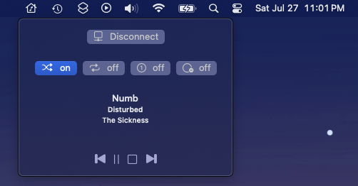

# MPD-MenuBar

A Mac OS Menu Bar Utility to control MPD

## Features
	Currently works on localhost & default mpd port
	Basic: Play, Pause, Stop, Previous Song, Next Song Controls
	Display current song playing
	Updates current song in a reasonable time
	toggle: repeat, random, single, consume

## Things to add in future
	Implament user adjustable ip & port
	Use mpd idle system instead of timer to receive player info
